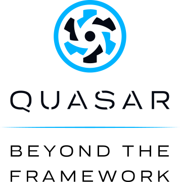

<div
    style="display: flex; gap: 20px;
           justify-content: center;
           align-items: center"
>
    <p>
        <a href="https://laravel.com" target="_blank">
            
        </a>
    </p>
    <p>
        <a href="https://laravel.com" target="_blank">
            
        </a>
    </p>
    <p>
        <a href="https://laravel.com" target="_blank">
            
        </a>
    </p>
</div>

# Projeto criado com Nuxt.js, Quasar Framework e Laravel retornanod dados de uma API REST do Banco Postgres

Certifique-se de instalar as dependências em `cd nuxt-project`:

```bash
# npm
npm install

# pnpm
pnpm install

# yarn
yarn install

# bun
bun install
```

## Para iniciar o projeto Nuxt

Será acionado em `http://localhost:3000`:

```bash
# npm
npm run dev

# pnpm
pnpm run dev

# yarn
yarn dev

# bun
bun run dev
```

Certifique-se de instalar as dependências em `cd laravel-api`:

```bash
# composer
composer install
```

## Para iniciar o projeto Laravel

Será acionado em  `http://127.0.0.1:8000`:

```bash
# artisan
php artisan serve
```
